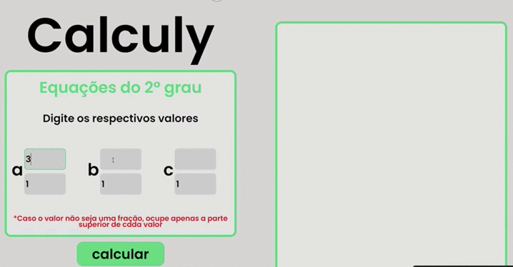

# Calculator

This project consists of a Quadratic equation calculator built in HTML, CSS and JavaScript.

## Instalation

Just clone this repository and open the index.html file on a server (The Visual Studio Code Live server extension for example)

## Example of use

Just add the numbers in the spaces provided and click on the "Calculate" button. The value will be illustrated on the screen.

## Meta

Vinícius de Sousa Carvalho – [@Vinci214](https://twitter.com/Vinci214) – sousav387@gmail.com

Distributed under the XYZ license. Look `LICENSE` for more informations.

[https://github.com/viniciussousa891/Calculator](s://github.com/viniciussousa891/Calculator)

## Contributing

1. Make the _fork_ do projeto (<https://github.com/viniciussousa891/Calculator/fork>)
2. Create a _branch_ for your modification  (`git checkout -b feature/fooBar`)
3. make the _commit_ (`git commit -am 'Add some fooBar'`)
4. _Push_ (`git push origin feature/fooBar`)
5. Create a new _Pull Request_

